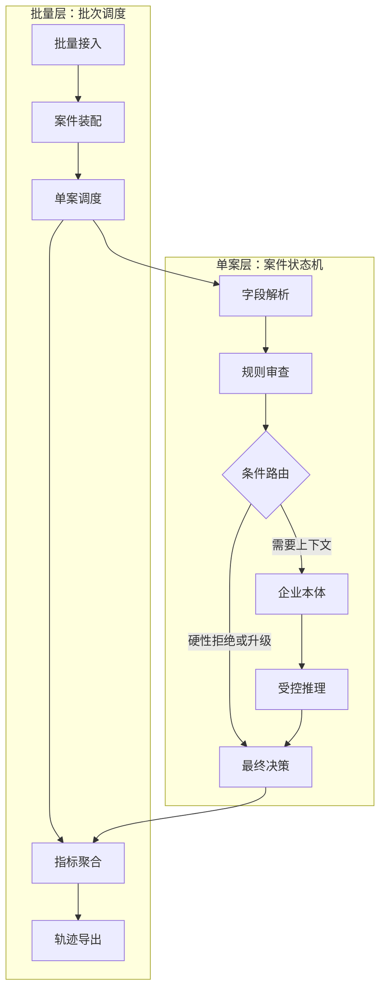

# FinTrace

<p align="center">
  
</p>

<p align="center">
  面向企业财务场景的可解释智能助手，从批量费控审查出发，逐步扩展到通用财务运营、审计辅助与风险治理。
</p>

---

## 项目定位

FinTrace 当前是一个中文企业级批量费控审查 Agent。它的第一阶段目标不是替代 ERP、OA 或财务终审，而是先解决财务审核中最痛的两个问题：

- **风险先筛出来**：批量导入报销数据后，自动识别重复票、缺附件、黑名单供应商、金额超标、拆票、跨期、OCR 金额冲突等风险。
- **错误能追回去**：每个字段、规则、上下文、推理和最终路由都保留溯源，方便财务人员、审计人员和产品团队定位问题。

FinTrace 的长期方向是 **通用财务智能助手**。费控审查只是第一个可落地入口，后续可继续扩展到：

- 费用政策问答与规则配置
- 发票、合同、付款、预算的交叉校验
- 月结异常解释与财务运营诊断
- 供应商、员工、项目维度风险画像
- 审计底稿生成与内控证据链沉淀

---

## 核心能力

| 能力 | 说明 |
|---|---|
| 批量接入 | 支持 CSV、XLSX、本地目录和 ZIP 批量导入，自动扫描文件清单 |
| 案件归并 | 将 ERP 行、发票 OCR、审批聊天、PDF/图片附件归并为单个报销案件 |
| 字段溯源 | 对金额、日期、发票号、供应商、员工、费用类型等字段记录来源和置信度 |
| 规则审查 | 区分阻断控制与上下文风险信号，高确定性风险不允许大模型覆盖 |
| 企业本体 | 引入节假日、客户等级、员工信用、供应商风险、费用基准等上下文 |
| 受控推理 | 本地稳定模型优先，可选 DeepSeek 生成结构化审计判断，并通过门控约束 |
| 红蓝评测 | 支持动态红队数据、冻结数据集回归、字段准确率和风控指标评估 |
| 人工反馈 | 人工复核通过的受控例外可沉淀为记忆，用于后续相似案件辅助判断 |

---

## 精简流程图


---

## 系统架构



---

## 决策边界

FinTrace 不把大模型当作最终裁判，而是把它放在受控链路中：

- **阻断控制优先**：缺原件、精确重复票、黑名单供应商等高确定性风险直接拒绝或升级。
- **风险信号转人工**：拆票、跨期、相似票号、OCR 金额冲突等需要业务解释的情况进入人工复核。
- **本地模型兜底**：无大模型配置时仍可稳定运行，适合企业离线演示和安全验证。
- **大模型受约束**：可选 DeepSeek 只做结构化审计判断，不能覆盖硬性风控底线。
- **全链路可追溯**：每个节点输出追踪事件，支持错误定位和回归评测。

---

## 快速开始

### 一、Docker 启动

```bash
docker compose up fintrace-frontend
```

启动后访问：

```text
http://localhost:8509
```

在界面中点击「加载示例批次」即可查看审核台、案件详情、字段溯源和评测面板。

### 二、Windows 启动

```batch
setup.bat
Start_FinTrace_Frontend.cmd
```

### 三、本地命令行

```bash
python cli.py run datasets/fintrace-redteam-v1 --output-root runtime/batches
```

---

## 评测方式

FinTrace 的评测不是只看单个演示样例，而是围绕风控工作流做回归验证。

### 动态红队评测

动态生成高仿真 ERP 报销数据、发票 OCR、审批聊天和标准答案，然后运行完整批量审查链路。

```bash
python cli.py eval --output-root runtime/eval --n 80 --seed 42
```

### 冻结数据集回归

读取固定数据集和标准答案，用于版本迭代后的稳定回归。

```bash
python cli.py eval-frozen datasets/fintrace-redteam-v1 --output-root runtime/eval_frozen
```

### 核心指标

| 指标 | 含义 |
|---|---|
| 决策准确率 | 系统最终结论与标准答案的一致性 |
| 硬违规召回率 | 应拒绝或升级的高风险案件是否被拦住 |
| 拒绝/升级精确率 | 被拦截案件中真正高风险的比例 |
| 硬违规综合分 | 精确率和召回率的综合表现 |
| 字段准确率 | 金额、日期、发票号、供应商等关键字段抽取质量 |
| 场景拆解 | 按重复票、拆票、跨期、金额冲突等场景分析错误 |

---

## 运行产物

每次批处理都会写入 `runtime/batches/<批次编号>/`：

| 文件 | 说明 |
|---|---|
| `manifest.json` | 文件清单 |
| `case_index.json` | 案件索引 |
| `batch_metrics.json` | 批次聚合指标 |
| `error_registry.json` | 错误注册表 |
| `batch_result.json` | 完整批处理结果 |
| `traces.jsonl` | 全链路追踪事件 |
| `cases/<案件编号>/case_result.json` | 单案审查结果 |

如果系统判断不符合预期，可以沿着字段、规则、本体、推理、路由和错误注册表定位问题来源。

---

## 项目结构

```text
FinTrace/
├── fintrace/                  核心 Python 包
│   ├── pipeline.py            批量调度状态机
│   ├── case_graph.py          单案审查状态机
│   ├── ingestion.py           文件接入、清单扫描、案件归并
│   ├── parser.py              字段抽取与字段溯源
│   ├── policies.py            费控规则与风险路由
│   ├── ontology.py            企业本体上下文
│   ├── reasoning.py           本地稳定模型与大模型门控
│   ├── feedback.py            人工反馈记忆
│   ├── evaluator.py           评测框架
│   ├── redteam.py             红队数据生成
│   ├── insights.py            业务诊断与优化建议
│   ├── showcase.py            展示与案例对比
│   └── tracing.py             全链路追踪事件
├── streamlit_app.py           财务审核台
├── cli.py                     命令行入口
├── datasets/                  冻结评测数据集
├── redteam/                   独立红队生成器
├── docs/                      项目文档与图片资产
├── runtime/                   运行产物目录
├── tests/                     单元测试
├── Dockerfile                 镜像构建
├── docker-compose.yml         容器编排
├── pyproject.toml             项目元数据
└── Makefile                   自动化命令
```

---

## 文档入口

- [流程图](docs/FINTRACE_FLOW.md)
- [最小可行范围说明](docs/MVP_SCOPE.md)
- [企业数据对接契约](docs/ENTERPRISE_INTEGRATION.md)
- [企业本体冷启动方案](docs/ONTOLOGY_COLD_START.md)
- [企业费用系统对标与改进](docs/ERP_EXPENSE_BENCHMARK.md)
- [红蓝对抗隔离说明](docs/RED_BLUE_ISOLATION.md)
- [开源评测集成方案](docs/OPEN_SOURCE_EVAL_INTEGRATION.md)
- [架构决策记录](docs/ARCHITECTURE_DECISIONS.md)
- [路线图](docs/ROADMAP.md)

---

## 下一步规划

- 增加差旅、招待、办公采购、会议、咨询服务等费用规则包。
- 建设规则配置中心，让阈值、审批层级和附件要求可配置。
- 增强 ERP、OA、费控系统对接设计，支持审批回写和审计日志同步。
- 增加业务指标看板，展示复核量、误报率、采纳率和节省时间。
- 强化真实财务场景评测，引入脱敏历史单据离线回放和人工复核对照。

---

## 设计原则

FinTrace 的核心原则是：**可信辅助，不做黑箱终审**。

在财务、审计和内控场景里，AI 的价值不是替人承担责任，而是帮助人更快发现风险、更清楚解释证据、更稳定地迭代规则。
