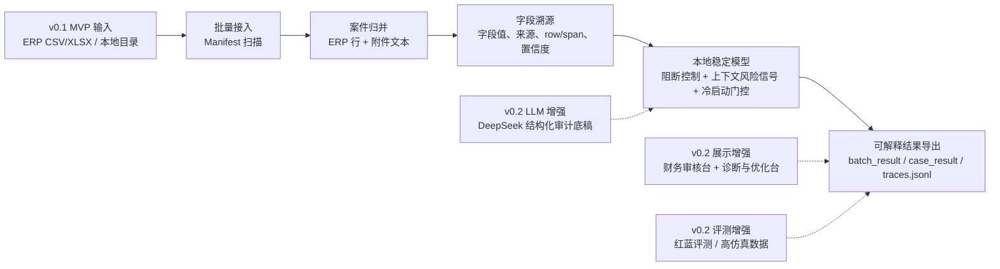
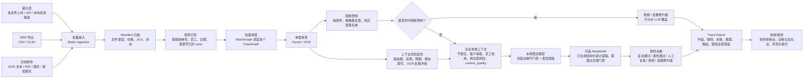
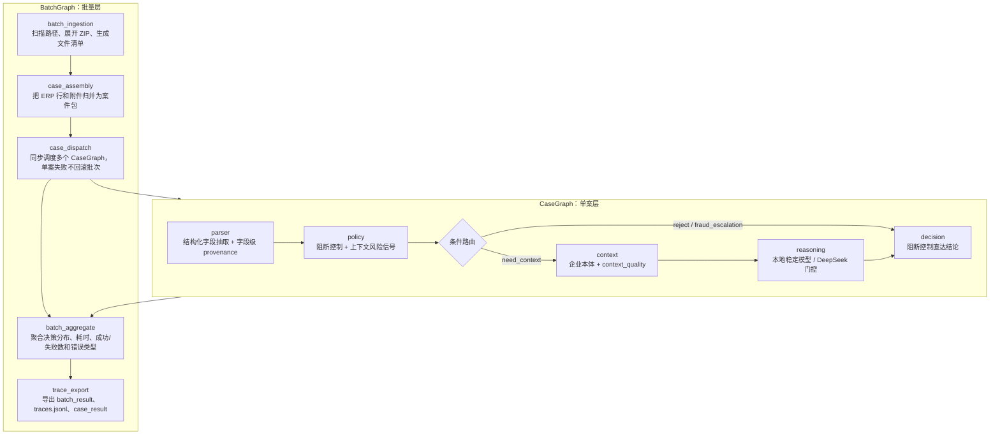
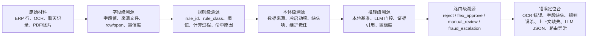
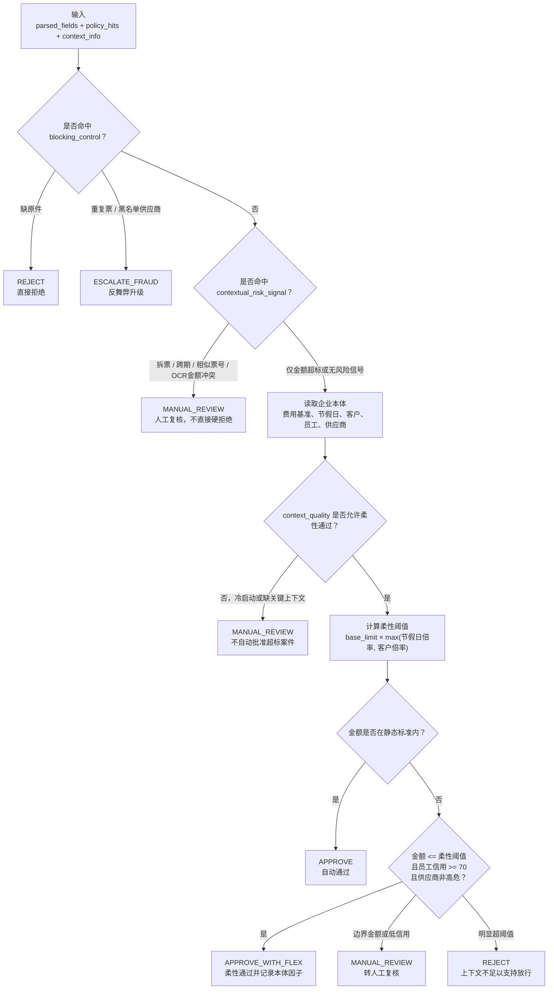

# FinTrace 流程图

这份流程图用于 GitHub 展示、面试讲解和录屏截图。整改后的核心表达是：v0.1 先跑通批量导入、字段溯源、本地稳定审查和可解释导出；DeepSeek、Streamlit 和红蓝评测是 v0.2 展示与增强能力。

## 1. MVP 与增强能力分层

## 2. 端到端批量审查流程

## 3. 双层 LangGraph 状态机

## 4. 可溯源调试链路

## 5. 本地稳定模型决策流

## 讲解口径

- 面向产品：v0.1 先服务财务审核员的批量初筛和错误定位，v0.2 再服务作品集展示和 LLM 增强。
- 面向风控：阻断控制只处理无歧义风险；拆票、跨期、相似发票号等进入上下文风险信号，避免误杀。
- 面向工程：BatchGraph 负责批量调度，CaseGraph 负责单案状态机，每个节点都输出 `TraceEvent`。
- 面向评测：红队生成高仿真 ERP 批次和异构附件，裁判器输出 Precision、Recall、F1、字段准确率和 case 级错误归因。
