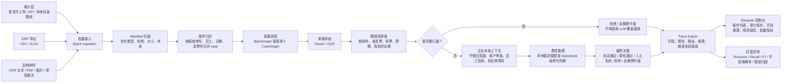
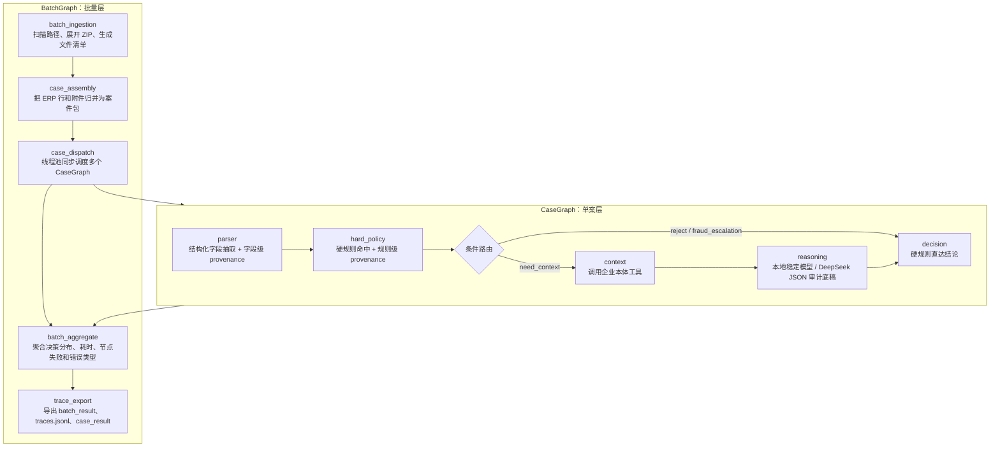
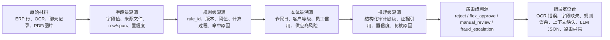
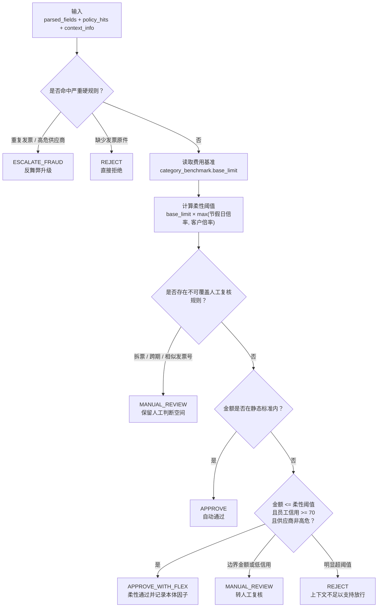

# FinTrace 流程图

这份流程图用于 GitHub 展示、面试讲解和录屏截图。FinTrace 的核心不是单张票据问答，而是“批量案件进入系统后，每笔报销都有可追踪的证据链、规则链、本体链、推理链和错误定位链”。

## 1. 端到端批量审查流程

## 2. 双层 LangGraph 状态机

## 3. 可溯源调试链路

## 4. 本地稳定模型决策流

## 讲解口径

- 面向业务：FinTrace 先守住硬性内控底线，再用企业本体做柔性判断，避免“一刀切”和“黑盒放行”。
- 面向工程：BatchGraph 负责批量调度，CaseGraph 负责单案状态机，每个节点都输出 `TraceEvent`。
- 面向评测：红队生成高仿真 ERP 批次和异构附件，裁判器输出 Precision、Recall、F1、字段准确率和 case 级错误归因。
- 面向调试：如果结论错了，可以沿着字段、规则、本体、推理、路由五条链快速定位问题点。
